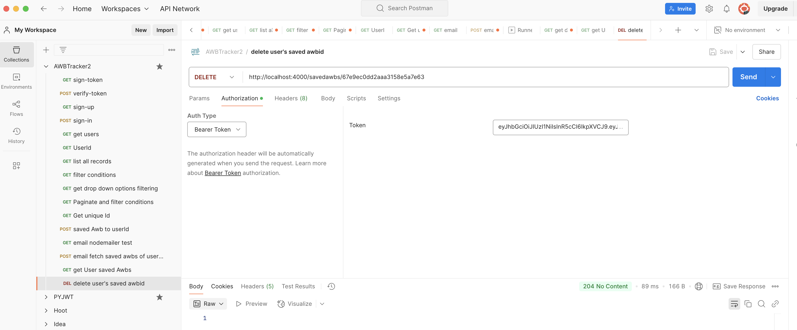
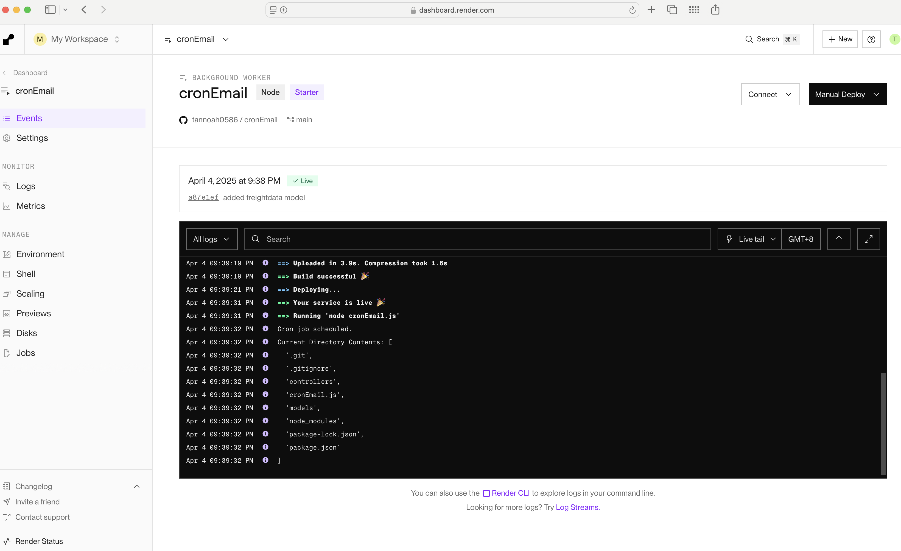
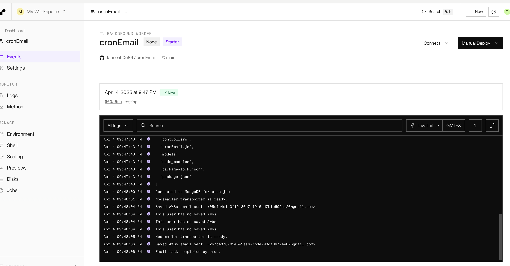

# Developing a AWB-Tracker2 Backend

# Link to Site
https://awb-tracker2.vercel.app/

# Timeframe
2 weeks

# MVP - Minimum Viable Product
* **User Authentication:**
    * Users can create accounts and log in securely.
* **Save AWBs:**
    * Users can save specific AWBs to their personal tracking list.
* **AWB Status Updates:**
    * The application retrieves and displays the latest status of saved AWBs.
    * Displays core shipment information, such as departure and arrival details, and proof of delivery status.
* **Email Notifications:**
    * Users receive automated email notifications when the Proof of Delivery (POD) status of their saved AWBs is updated or remains empty for a period of time.
* **User Saved AWB list:**
    * Users are able to view a list of all of their saved AWBs.
    * Users are able to delete AWBs from their saved list.
    * Users are able to edit the saved AWBs.
* **Basic AWB Search:**
    * Users are able to search for AWBs, using specific search parameters.
* **Data Persistence:**
    * Data is stored in a MongoDB database.

## Technical Stack

* **Backend:**
    * Node.js with Express.js
    * MongoDB for database
    * Nodemailer for email services.
    * Node-cron for scheduled email task.

## Future Enhancements (Post-MVP)

* Advanced search and filtering options.
* Real-time map visualization of shipment locations.
* Integration with multiple carrier APIs (or with OTM)
* User role management (admin, etc.).
* Detailed shipment history.
* File upload for POD documents.

## Reflections
* Pros: successful deploying of web applicaiton of a cron-mailer 'useful' app
* Cons: time mgmt 

## Backend API Planning/Testing (Postman Screenshots)

**Description:** Demonstrates the successful generation of a JSON Web Token (JWT) after user authentication.

**Description:** Shows the verification of a JWT, confirming its validity for authorized access to protected routes.

**Description:** Illustrates the successful creation of a new user account via the signup API endpoint.

**Description:** Displays the successful login of an existing user and the retrieval of an authentication token.

**Description:** Shows the retrieval of a list of all users from the database.

**Description:** Demonstrates retrieving information for a specific user ID, ensuring authorization.

**Description:** Illustrates the retrieval of all records from the server's data source.

**Description:** Shows the application of filter conditions to the data retrieval endpoint.

**Description:** Demonstrates the implementation of pagination combined with filter conditions for data retrieval.

**Description:** Displays the details of a specific AWB (Air Waybill) record.

**Description:** Shows the saving of an AWB record, using the user's ID as a foreign key for association.

**Description:** Demonstrates the successful execution of Nodemailer for sending email notifications.

**Description:** Demostrates the successful execution of cron and nodemailer for sending email notificaitons according to users.

**Description:** Postman testing to show successful return to frontend for a backend request of get all of the user's protected AWBs.

**Description:** Postman showing successful 204 successful deletetion of user's savedAwbId.

**Description:** showing logs of sucessful implementation of PAAS background worker to keep server running to execute cron jobs

**Description:** logs of properly execution of cron-nodemailer

**References:**

    https://www.freecodecamp.org/news/use-nodemailer-to-send-emails-from-your-node-js-server/

    https://www.nodemailer.com/about/

    https://www.npmjs.com/package/node-cron

    https://render.com/docs/web-services#port-binding

    https://fontawesome.com/kits/new
