# AWB-Tracker2

Project Goal: To create a MERN application that simulates OTM data, automates AWB monitoring for your assigned lanes, provides timely notifications, and offers a user-friendly dashboard for efficient tracking.

Core Functionality:

- **Simulated OTM Data (MongoDB):**

  - Manually populate a MOngoDB database with sample AWB data, mimicking OTM reports.
  - Include fields: `awb_number`, `service_provider`, `origin`, `destination`, `lane`, `expected_delivery_date`, `status`, `last_updated`.
  - Scheduled tasks will simulate OTM updates by randomly changing the `status` and `last_updated` fields, and checking for risk.
  **Note:** The choice of MongoDB is intentional due to the anticipated frequent schema changes from company server APIs. Using a non-relational database like MongoDB provides greater flexibility in accommodating these changes.

- **Lane Management:**

  - Allow users to select and save their assigned lanes.
  - Store user-lane assignments in the database.

- **Automated Risk Assessment:**

  - Flag at-risk AWBs within the user's saved lanes.

- **Email Notifications:**

  - Send email notifications for at-risk or failed AWBs within the user's saved lanes.
  - Use Nodemailer for email sending.

- **Dashboard and Filtering:**

  - Display a dashboard with the latest AWBs.
  - Provide filtering options based on lane, origin, destination, and mode of transport.

- **Authentication and Authorization:**
  - Implement user creation, login, and logout.
  - Simple role-based access control (optional, admin/user). (if time allows)

Prioritized User Stories:

- **Authentication:**

  - As a user, I want to log in with my username/email and password so that I can access my AWB information.
  - As a user, I want to sign up for an account with my username/email and password so that I can use the application.
  - As a user, I want to log out of the application so that my session is secure.

- **Dashboard & Filtering:**

  - As a user, I want to see a list of all AWBs on a dashboard so that I have a quick overview.
  - As a user, I want to filter the AWBs by lane, origin, destination, and mode of transport so that I can find specific shipments.

- **Lane Management:**

  - As a user, I want to select and save the lanes I am responsible for so that I can focus on my shipments.

- **Email Notifications:**
  - As a user, I want to customize my email notification preferences (enable/disable, at-risk, failed) so that I can control how I am alerted.
  - As a user, I want to see a column that shows when an email notification was sent, so that I have a log.

Wireframes (Simplified):

- **Login/Signup Page:**

  - Fields for username/email and password.
  - "Login" and "Signup" buttons.
  - "Forgot Password" link.

- **Dashboard:**

  - Filters:
    - Dropdowns for Lane, Origin, Destination, Mode of Transport.
    - "Apply Filters" button.
  - AWB Table:
    - Columns: AWB Number, Service Provider, Origin, Destination, Lane, Mode, Expected Delivery, Status, Last Updated, Risk Status (Flagged or not), Notification Sent.
    - Highlight at-risk AWBs (e.g., red background).

- **Lane Management Page:**

  - List of available lanes with checkboxes.
  - "Save Selected Lanes" button.
  - Display of currently saved lanes.

- Notification Settings (User Profile): \* Checkbox to enable/disable email notifications.
  Backend (Node.js/Express.js):

- **Database:** MongoDb

- **API Endpoints:**

  - /auth/login, /auth/signup (authentication).
  - /awbs (get filtered AWBs).
  - /lanes (get/save user lanes).
  - /notifications (send email notifications).

- **Authentication:** jsonwebtoken, bcrypt.
- **Email:** nodemailer.
- **Scheduled Tasks:** node-cron will simulate OTM updates, perform risk assessments, and trigger email notifications.
  Frontend (React.js/TypeScript):
- **UI Library:** Material-UI or Tailwind CSS (for simple, clean design). // still deciding
- S**tate Management:** Context API or React Hooks (for simplicity).
- **Routing:** react-router-dom.
- **Form Handling:** React Hook Form.
- **Data Tables:** react-table or Material-UI data tables.
- useEffect and setInterval will poll the backend API for updated AWB data.
  Implementation Steps (Simplified):

1. **Database Setup:** Create MongoDB tables for AWBs and user-lane assignments.
2. **Backend API:**
   - Implement authentication endpoints.
   - Create API endpoints for retrieving and filtering AWBs.
   - Implement lane management endpoints.
   - Set up Nodemailer for email notifications.
   - Use node-cron to schedule tasks.
3. **Frontend Development:**
   - Create login/signup forms.
   - Build the dashboard with filtering and FreightData table.
   - Implement lane selection and saving.
   - Integrate with the backend API.
4. **Testing:**
   - Unit tests for backend API endpoints.
   - Integration tests for data flow and notifications.
   - End-to-end tests for user workflows.
5. **Deployment:** Deploy the application to a platform like vercel and render (done).
## Backend API Planning (Postman Screenshots)

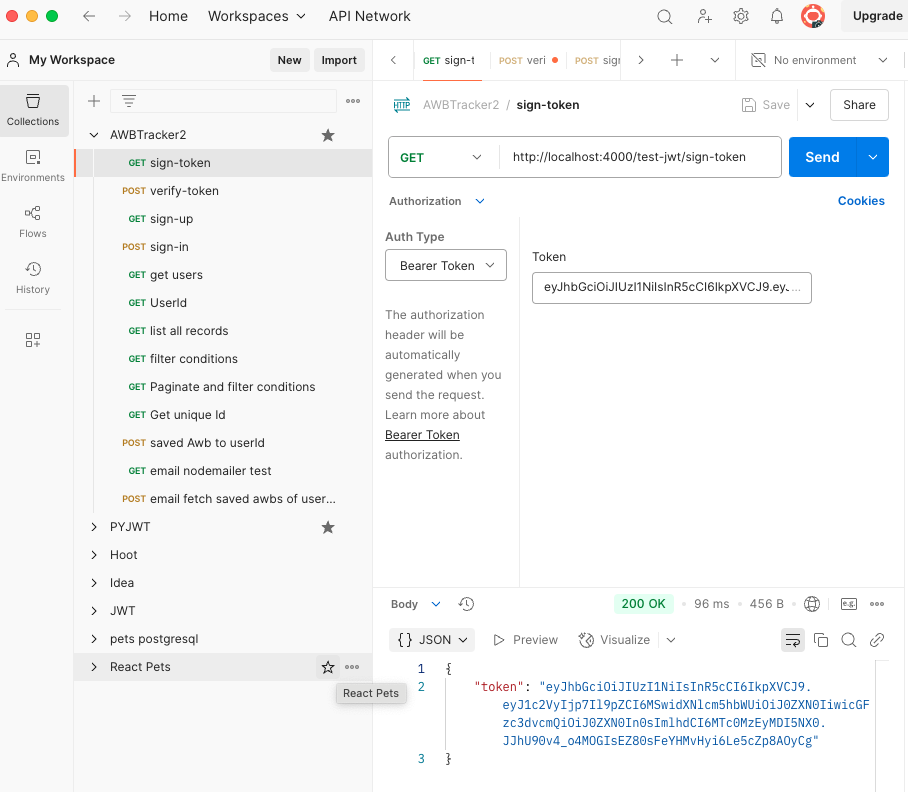
**Description:** Demonstrates the successful generation of a JSON Web Token (JWT) after user authentication.

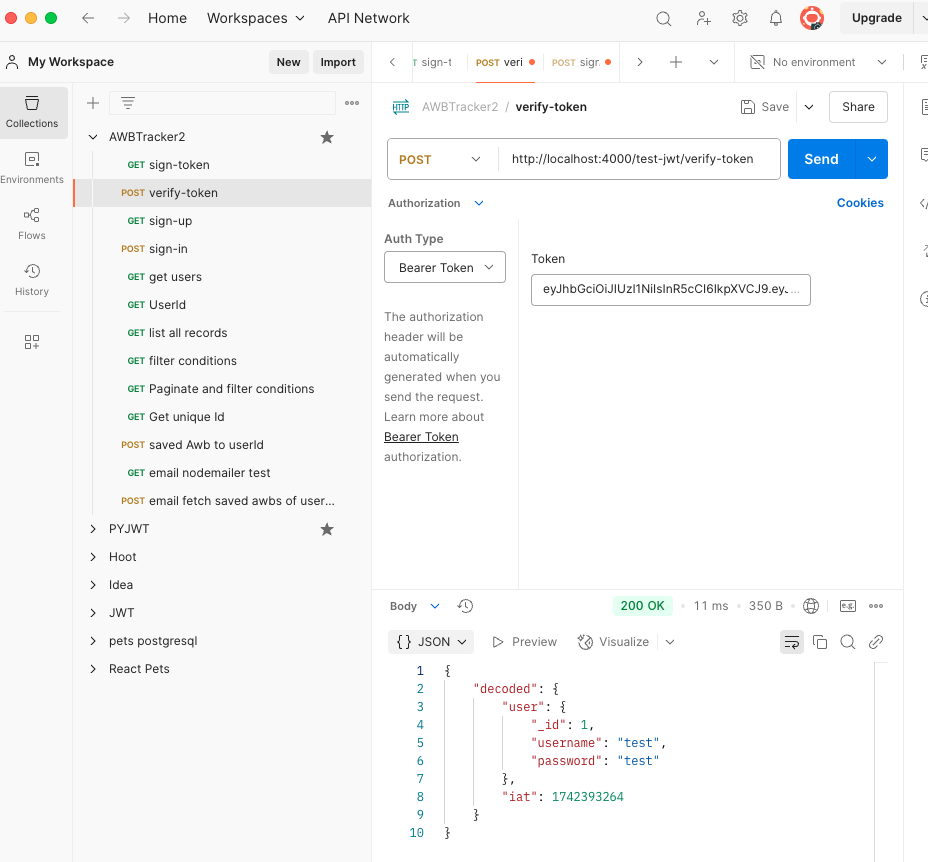
**Description:** Shows the verification of a JWT, confirming its validity for authorized access to protected routes.

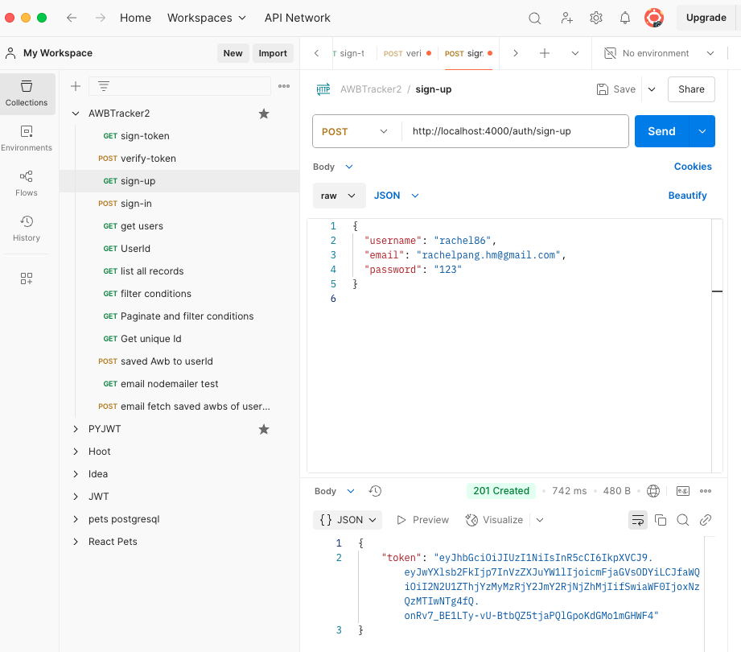
**Description:** Illustrates the successful creation of a new user account via the signup API endpoint.

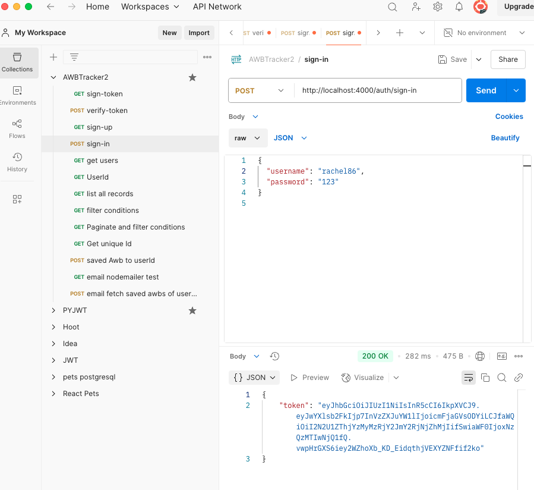
**Description:** Displays the successful login of an existing user and the retrieval of an authentication token.

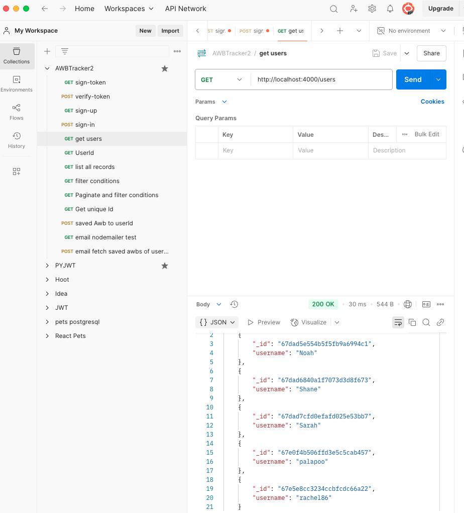
**Description:** Shows the retrieval of a list of all users from the database.

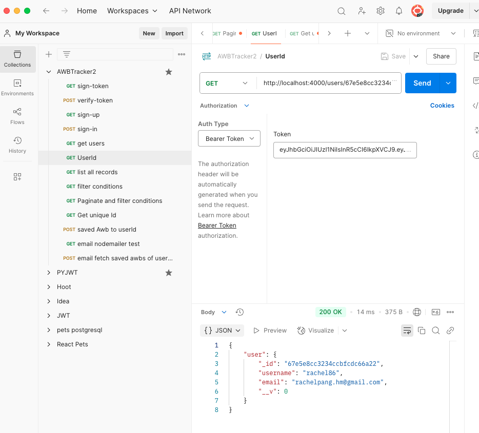
**Description:** Demonstrates retrieving information for a specific user ID, ensuring authorization.

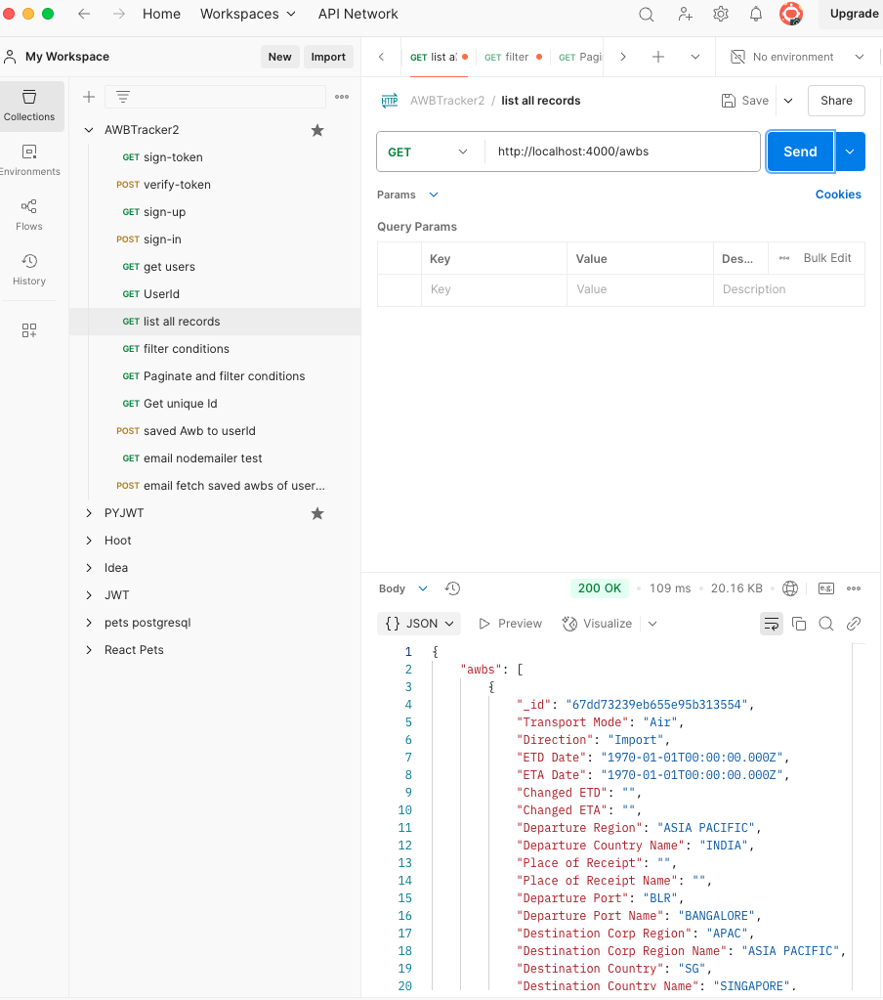
**Description:** Illustrates the retrieval of all records from the server's data source.

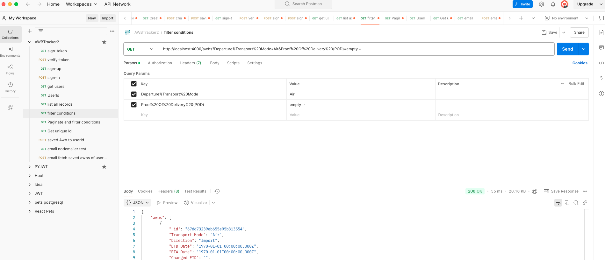
**Description:** Shows the application of filter conditions to the data retrieval endpoint.

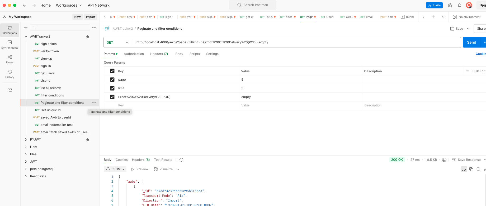
**Description:** Demonstrates the implementation of pagination combined with filter conditions for data retrieval.

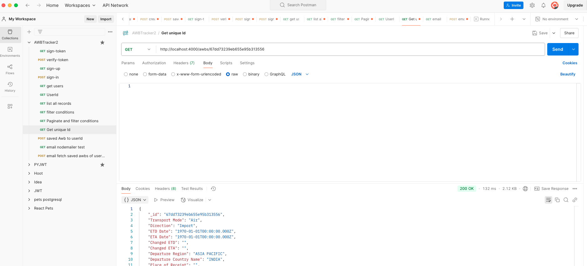
**Description:** Displays the details of a specific AWB (Air Waybill) record.

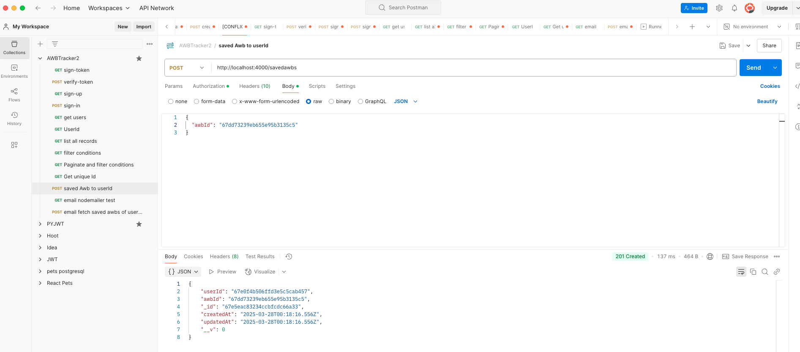
**Description:** Shows the saving of an AWB record, using the user's ID as a foreign key for association.

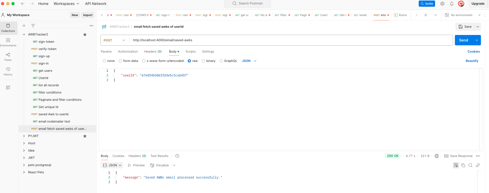
**Description:** Demonstrates the successful execution of Nodemailer for sending email notifications.

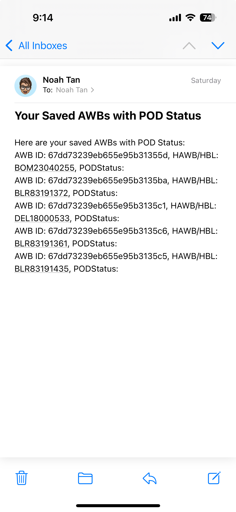
**Description:** Demostrates the successful execution of cron and nodemailer for sending email notificaitons according to users.

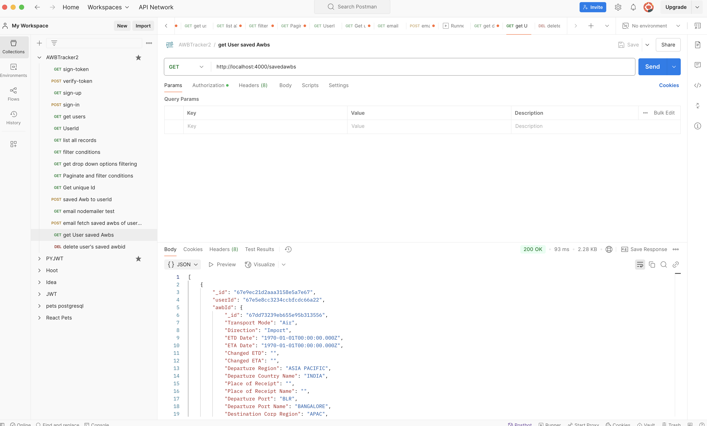
**Description:** Postman testing to show successful return to frontend for a backend request of get all of the user's protected AWBs.

**References:**

    https://www.freecodecamp.org/news/use-nodemailer-to-send-emails-from-your-node-js-server/

    https://www.nodemailer.com/about/

    https://www.npmjs.com/package/node-cron

    https://render.com/docs/web-services#port-binding
